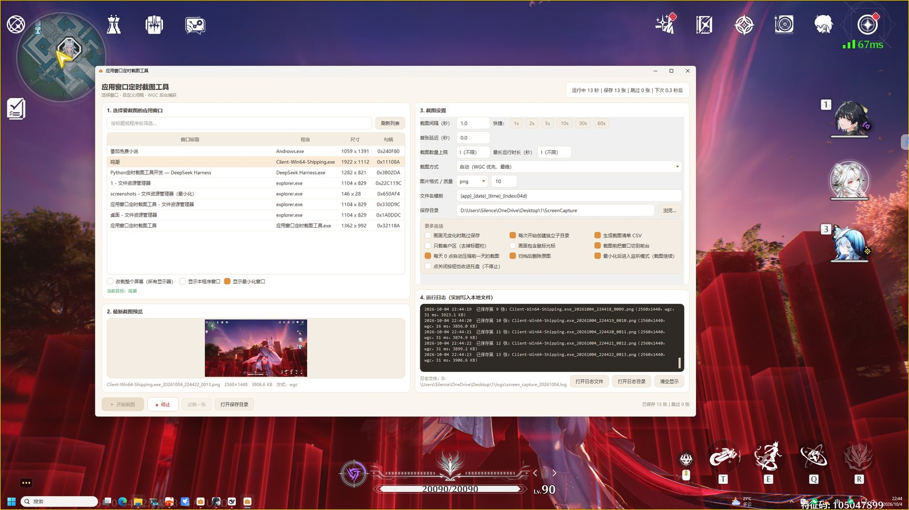
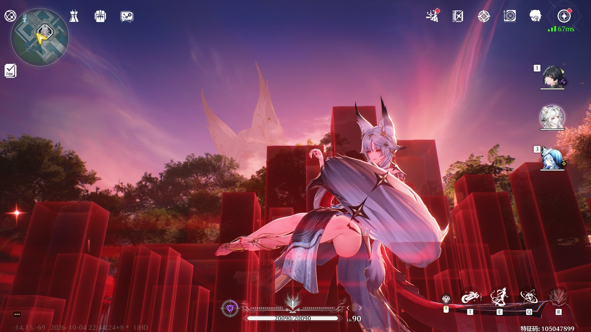

# 应用窗口定时截图工具（Python / Windows）

选择一个正在运行的应用窗口（或整个屏幕），按你手动设置的**间隔时间**自动反复截图。
界面用 **PyQt5** 写成奶白色现代风格，日志实时写入本地文件。

* **WGC 窗口捕获**：基于 Windows Graphics Capture，窗口被遮挡、在后台也能截到**窗口自己的画面**，
  不会再出现「截到应用所在区域、里面全是压在上面的其它窗口」这种问题
* 界面 **PyQt5**（奶白 + 焦糖配色）；tkinter 版保留作后备
* 截图循环跑在后台线程，界面不卡；可随时停止；支持「试截一张」先看效果
* 输出文件命名、格式、目录都可自定义，自动生成 CSV 清单；**运行日志实时落盘**

---

## 下载（免安装便携版）

不想折腾 Python 环境就直接下这个（Gitee 在国内最快）：

| 平台 | 下载 |
| --- | --- |
| **Gitee（推荐）** | [⬇ ScreenCaptureTool_v1.0.6_portable_win64.zip](https://gitee.com/silence95/Screen_Capture/releases/download/v1.0.9/ScreenCaptureTool_v1.0.9_portable_win64.zip) |
| GitHub（归档） | [⬇ ScreenCaptureTool_v1.0.4_portable_win64.zip](https://github.com/silencezcp/Screen_Capture/releases/download/v1.0.4/ScreenCaptureTool_v1.0.4_portable_win64.zip) |

代码仓库同步在 [Gitee](https://gitee.com/silence95/Screen_Capture)（主仓库）、
[GitCode](https://gitcode.com/qq_24919633/Screen_Capture)、
[GitHub](https://github.com/silencezcp/Screen_Capture)（归档）。
便携包附件发布在 Gitee 发行版（GitCode 的 API 不支持上传附件，只能在其网页上手动上传）。

约 70 MB —— 解压到任意**普通目录**（桌面 / 文档 / `D:\Tools`），双击
`应用窗口定时截图工具\应用窗口定时截图工具.exe` 即可使用，免安装、免配置。

> * 别只把 exe 单独拷出来，它需要同级的 `_internal` 文件夹；
> * 程序未签名，首次运行可能弹 SmartScreen，点「更多信息」→「仍要运行」；
> * 解压目录若带「低完整性标签」（沙箱 / 受限工作区），进程会被降级为低权限、WGC 会被系统拒绝，
>   放到桌面这类普通目录即可；自检里的「运行权限」会显示当前级别（`Medium` 正常）。
> * 全部版本：[Gitee Releases](https://gitee.com/silence95/Screen_Capture/releases) ｜
>   [GitHub Releases](https://github.com/silencezcp/Screen_Capture/releases)。

> **仓库同步**：主仓库在 **Gitee**，GitCode 与 GitHub 为镜像，代码与标签保持一致。
> 日常推送只走 Gitee + GitCode（`git push origin main` 一条命令推两个平台）。

## 系统兼容性（含 Windows Server）

| 系统 | 能不能跑 | WGC 窗口捕获 |
| --- | --- | --- |
| Windows 11 / Windows 10 1803+ | ✅ | ✅ 可用（被遮挡也能截到窗口自己） |
| **Windows Server 2019**（build 17763） | ✅ | ✅ 可用 |
| **Windows Server 2016**（build 14393） | ✅ **能跑** | ❌ **不可用**，自动退回 PrintWindow / 屏幕区域 |
| Windows 10 1607~1709、Server 2012 R2、Win 8.1 | ✅ 能跑 | ❌ 不可用（同上） |

原因：`Windows.Graphics.Capture` 从 **Windows 10 1803（build 17134）** 才提供
（[MS Learn](https://learn.microsoft.com/en-us/uwp/api/windows.graphics.capture.graphicscapturesession)），
而 Server 2016 是 1607 内核（build 14393）。程序会**先检测系统构建号**，低于 17134 直接判定 WGC 不可用，
不会去调用不存在的接口，日志/自检里会写明原因，然后自动改用 PrintWindow（后台截图）或屏幕区域方式。

所以在 Server 2016 上：**定时截图、按窗口标题分目录、实时日志、每日归档、监听模式都正常**，
只是截「被其它窗口遮挡的窗口」时，会退化成屏幕区域方式（该窗口被挡住时会把遮挡物也截进去）。
自检命令能一次看清当前环境：

```bat
应用窗口定时截图工具.exe --selftest
:: 会输出「系统版本」「运行权限」「WGC 窗口捕获」等 11 项
```

其他注意点：
* 需要装 **桌面体验**（Desktop Experience）；**Server Core** 没有图形界面，界面版跑不起来；
* 通过 **RDP 断开的会话**运行时，桌面可能不渲染，截图会发黑 —— 保持会话连接或使用控制台会话；
* PyQt5 界面依赖系统里的常用字体，Server 上若字体缺失界面会难看但功能不受影响。

## 服务器 / 多人同时使用（RDS 远程桌面）

**服务器上装一份、所有用户共用**：以管理员身份双击 `安装给所有用户-需管理员.bat`，它会

1. 把程序复制到 `C:\ProgramData\ScreenCaptureTool`（普通目录 → WGC 可用）；
2. 把目录权限设为 **所有用户只读+执行、管理员可写**；
3. 放置 `multi_user.txt` 标记；
4. 在**公用桌面**建快捷方式，所有登录用户都能看到。

> 如果普通用户双击报「**Windows 无法访问指定设备、路径或文件。你可能没有适当的权限访问该项目**」，
> 说明文件权限没落地（≤ v1.0.7 的 `--all-users` 授权用错了 icacls 参数）：
> 以管理员身份运行 `修复所有用户权限-需管理员.bat` 即可修好（v1.0.8 起安装脚本已修正）。

程序检测到这个标记后进入「多人共用模式」：**日志与默认截图目录自动放到每个用户自己的**
`%LOCALAPPDATA%\ScreenCaptureTool\{logs,ScreenCapture}`，多人同时跑不会互相覆盖或争用同一个日志文件
（界面设置基于每个用户的注册表 `HKCU`，天然各自独立）。

| 关注点 | 多人时的行为 |
| --- | --- |
| 单实例 | 命名管道按 **用户 + 会话** 区分：A 用户开着不影响 B 用户启动；同一个用户在同一会话里只会有一个实例，重复双击会把已有窗口叫到前台 |
| 截图目标 | 只能看到/截取**自己会话里**的窗口（Windows 会话隔离，抓不到别人的桌面） |
| 日志 / 截图目录 | 每人一份（`%LOCALAPPDATA%\ScreenCaptureTool\...`），互不干扰 |
| 每日归档 | 每个用户的实例各自归档自己目录里的图 |
| WGC | Server 2019 可用；**Server 2016 不可用**（见上一节），会自动退回 GDI 方式 |
| 资源占用 | 每个实例都是独立进程，各跑各的定时器；人多时建议把间隔调大一些，或只在需要时开始截图 |

**重要：远程桌面断开连接时不要让它继续跑**。RDP 会话断开后桌面不再渲染，截图会变全黑
（WGC / PrintWindow / 屏幕区域都拿不到画面）。要么保持会话连接（可最小化 RDP 窗口），
要么断开前先停止任务。服务器上同理：**没有人登录的控制台会话截不到东西**。

## 1. 运行环境

| 项目 | 要求 |
| --- | --- |
| 系统 | Windows 10 1903+ / Windows 11（WGC 要求 1903+；光标捕获要求 2004+） |
| Python | 3.9 及以上 |
| 依赖 | `Pillow`、`PyQt5`、`wgc_python`（自动带上 numpy） |

```bat
pip install -r requirements.txt
```

> **本项目已经把依赖装好放在 `packages\` 里了**（PyQt5、PyQt5-Qt5、PyQt5-sip、wgc_python、numpy、
> 以及打包用的 PyInstaller 及其依赖，共约 196 MB）。几个 .bat 都会自动把它加到 `PYTHONPATH`，
> 所以在这台机器上**不用再 pip 安装**就能直接跑/打包。换机器时把 `packages\` 一起拷过去即可；
> 想自己装就按下面的 requirements 走。

`requirements.txt` 里三条：

```
Pillow>=9.1.0
PyQt5>=5.15
wgc_python>=2.0
```

## 2. 启动

```bat
双击  启动截图工具.bat            :: 从源码运行（PyQt5 界面）
双击  启动截图工具-免提示.bat      :: 直接启动打包好的 exe，不弹 SmartScreen
python run.py                 :: 默认 PyQt5 界面
python run.py --ui tk         :: 改用旧的 tkinter 界面（PyQt5 装不上时也会自动退回）
python -m screen_capture
```

> 打包后的 exe 没有数字签名，Windows 11 首次双击可能弹 SmartScreen 提示；
> 处理办法见文末常见问题。

界面分四块（截图见 `docs/ui_preview.png`）：

1. **选择要截图的应用窗口** —— 列出当前所有可见窗口（标题 / 程序 / 尺寸 / 句柄），可按关键字筛选；
   勾选「改截整个屏幕」可截所有显示器。
2. **最新截图预览** —— 每次保存后自动显示缩略图。
3. **截图设置** —— 截图间隔（可手输，也有 `1s/2s/5s/10s/30s/60s` 快捷键）、首张延迟、数量上限、
   最长运行时长、**截图方式**、图片格式/质量、文件名模板、保存目录，以及 6 个开关：
   - 画面无变化时跳过保存
   - 每次开始创建独立子目录
   - 生成截图清单 CSV
   - 只截客户区（去掉标题栏）
   - 画面包含鼠标光标
   - 截图前把窗口切到前台（屏幕区域方式用）
4. **运行日志** —— 实时显示，并且**同步写入本地日志文件**，可一键打开日志文件/日志目录。

「更多选项」单独成卡片，3 列排布：画面无变化时跳过保存、每次开始创建独立子目录、生成截图清单 CSV、
只截客户区、画面包含鼠标光标、截图前把窗口切到前台、**每天 0 点自动压缩前一天的截图**、
归档后删除原图、**最小化时收进托盘**、**点关闭按钮也收进托盘（不停止）**。

**运行中改设置立即生效**：任务跑起来之后，直接改间隔、数量上限、最长时长、截图方式、图片格式/质量、
文件名模板、保存目录、子目录方式、以及下面 6 个开关，都会**马上应用到正在运行的任务**，
不需要先停止再重新开始。日志里会打一行「已即时生效（无需重启任务）：…」说明改了哪些项。

**子目录方式**（保存到哪儿）：

| 方式 | 效果 |
| --- | --- |
| **按窗口标题分文件夹（默认）** | `ScreenCapture\<窗口标题>\`，**不同窗口标题各自一个目录**（`鸣潮\`、`番茄免费小说\`…），同一个标题复用同一个文件夹；清单也追加在该目录的同一个 CSV 里 |
| 每次开始新建带时间戳的文件夹 | `ScreenCapture\<窗口标题>_20261004_225657\`，每次开始一个新文件夹 |
| 不用子目录 | 截图直接平铺在保存目录里 |

> 文件夹名 = **窗口标题**（会替换 `\ / : * ? " < > |` 等非法字符、折叠空格、限长 80 字）；
> 标题为空的窗口退回进程名，捕获整个屏幕时用 `整个屏幕`。
> 文件名里的 `{app}` 仍是**进程名**（如 `Client-Win64-Shipping.exe`），标题变了文件名风格也不变。

底部按钮：`▶ 开始截图`、`■ 停止`、`试截一张`（只预览不落盘）、`打开保存目录`。

**后台运行（监听模式）**：

* **窗口最小化 = 进入监听模式**，截图继续跑；窗口**留在任务栏**（点任务栏图标就能回来），
  不会因为最小化而找不到窗口；
* 勾选「最小化时收进托盘」后才会收起托盘（双击托盘图标恢复）；
* **只有退出程序才停止截图**：点窗口的 ×、或托盘菜单「退出」时会提示「关闭程序会停止截图」；
* 勾选「点关闭按钮也收进托盘（不停止）」后 × 只收进托盘，要结束得用托盘菜单「退出」；
* **重复启动会自动召回**：程序已经在跑时再双击一次 exe，会把已有窗口显示出来（不会开出第二个实例）。

> **默认保存目录 = 程序目录下的 `ScreenCapture`**：
> 源码运行是 `项目目录\ScreenCapture\`，打包后是 `exe 所在目录\ScreenCapture\`；
> 想放到别处直接在界面里改。程序目录不可写（例如放进 Program Files）时会自动退到
> `%LOCALAPPDATA%\ScreenCaptureTool\ScreenCapture`。

## 3. 截图方式

| 方式 | 原理 | 说明 |
| --- | --- | --- |
| **自动（默认）** | 先 WGC，失败再 PrintWindow，最后屏幕区域 | 推荐，绝大多数情况都够用 |
| **WGC** | Windows Graphics Capture，抓 GPU 合成输出 | **被遮挡 / 在后台也能截到窗口自己的画面**，游戏也能截 |
| **PrintWindow** | 让窗口重绘到内存 DC | 大多数普通程序可用；GPU 窗口、部分游戏会被系统拒绝（错误码 5） |
| **屏幕区域** | 从屏幕拷贝窗口所在矩形 | 所见即所得；被遮挡就会截到遮挡物 |

**为什么需要 WGC**：`PrintWindow` / `BitBlt` 这类 GDI 方案对 GPU 渲染的窗口（游戏、浏览器）基本无效，
只能退回屏幕区域截图，于是窗口上压着的其它窗口就被一起截进去了。WGC 直接向 DWM 取窗口自己的合成画面，
这才是「截应用自己的图」的正确做法——ok-script / ok-ww 这类自动化框架用的也是同一套思路。

同一时刻、同一个《鸣潮》窗口，两种方式的差别（图在 [docs/](docs/)）：

| 屏幕区域方式（被遮挡时的结果） | WGC 方式 |
| --- | --- |
|  |  |
| 截到的是盖在游戏上的程序窗口，共 52.8% 像素与真实画面不同 | 截到游戏自己的画面，干净无遮挡 |

> 如果程序所在目录带「低完整性标签」，Windows 会拒绝 WGC，此时界面顶部会出现**醒目提示条**，
> 点上面的「复制到本机并重启（修复）」即可一键搬到普通目录；也可以直接双击
> `修复WGC权限-需管理员.bat`（管理员）把当前目录的完整性标签改回 Medium。

WGC 相关细节：

* 使用 [`wgc_python`](https://pypi.org/project/wgc-python/)（MIT，包内自带 DLL）；
* 会话**常驻复用**：开始时建立一次，之后按需取帧，停止时关闭（避免频繁建/销会话的开销）；
* WGC 是「内容变化才推帧」的，所以本工具保持会话运行、直接读最近一帧，
  静止窗口也能连续截到同样的画面；
* Windows 11 在捕获期间会在被截窗口外围画一圈**黄色边框**（系统行为），停止截图后消失；
* 目标窗口没有响应时不会硬等：先用 `WM_NULL` 探活，不响应就自动改用 GDI 方式。

## 4. 命令行用法

```bat
python run.py --list                          :: 列出可见窗口
python run.py --cli --title 记事本 --interval 2 --count 5 --out D:\shots
python run.py --cli --index 3 --interval 0.5 --duration 10 --out D:\shots --method wgc
python run.py --cli --screen --interval 60 --count 3 --skip-unchanged --out D:\shots
python run.py --selftest                      :: 环境自检（含 WGC / PyQt5）
```

| 参数 | 说明 |
| --- | --- |
| `--list [--all] [--keyword 关键字]` | 列出可见窗口 |
| `--cli` | 命令行模式截图（不加则开界面） |
| `--screen` / `--hwnd 0x1A2B` / `--title 名称` / `--index N` | 指定目标 |
| `--interval 秒` | **截图间隔**，默认 5，最小 0.1 |
| `--count N` / `--duration 秒` / `--delay 秒` | 张数上限 / 最长运行 / 首张延迟，0 = 不限 |
| `--method auto\|wgc\|printwindow\|screen` | 截图方式，默认 `auto` |
| `--client-only` / `--cursor` / `--no-activate` | 只截客户区 / 含光标 / 不抢焦点 |
| `--out 目录` | 保存目录，默认 `程序目录\ScreenCapture` |
| `--format` `--quality` `--pattern` | 格式 / 质量 / 文件名模板 |

> **质量参数只对 `jpg` / `webp` 有效**。`png` / `bmp` 是无损格式，改质量不会有任何变化 ——
> 界面上选到这两种格式时，质量输入框会**自动禁用并提示原因**（避免白改一通）。
> 想让截图更省空间：格式选 `jpg`（质量 85~90 通常够用）或 `webp`。同一张 900×600 的图实测：
> `jpg` 质量 10 ≈ 28 KB、质量 90 ≈ 128 KB、质量 100 ≈ 378 KB；`png` ≈ 276 KB；`bmp` ≈ 1.6 MB。
| `--no-subdir` `--skip-unchanged` `--no-manifest` `--quiet` | 各类开关 |
| `--folder-mode app\|session\|flat` | 子目录方式，默认 `app`（按窗口标题分文件夹） |
| `--archive-now [目录]` | 立刻把「早于今天」的截图压缩成 `_archive\YYYY-MM-DD.zip`（默认删除原图） |
| `--archive-keep` | 配合 `--archive-now`：归档时保留原图 |
| `--ui qt\|tk` | 界面实现 |
| `--selftest [目录]` | 自检并输出报告 |

## 5. 日志与输出文件

**日志**（实时写入，界面里也能看到同样的内容）：

```
<程序目录>\logs\screen_capture_YYYYMMDD.log
```

程序目录不可写时退到 `%LOCALAPPDATA%\ScreenCaptureTool\logs`，再不行用系统临时目录；
单个日志 2 MB 滚动、保留 5 个备份；界面底部会显示当前日志文件路径。

**截图**默认保存在 **程序目录下的 `ScreenCapture\`**（界面里可改；勾选「按会话创建子目录」时再带一层
`应用_20261004_211009\`）：

```
<程序目录>\ScreenCapture\
├─ 鸣潮_20261004_211009_0001.png
├─ 鸣潮_20261004_211014_0002.png
└─ capture_manifest.csv          :: 序号/时间/文件名/宽高/截图方式/是否保存/备注
```

源码运行时程序目录就是项目根目录，所以截图会落在 `项目目录\ScreenCapture\`；
打包后则是 `exe 所在目录\ScreenCapture\`。

**每日自动归档（省空间）**：勾选「每天 0 点自动压缩前一天的截图」后，程序会在每天 00:00 把
**前一天**（以及更早、还没归档的）图片打包成 zip，默认压缩后删除原图：

```
<保存目录>\_archive\2026-10-04.zip      ← 里面保留原来的相对路径
```

* 正在写入的文件会自动跳过，不会影响正在进行的截图；
* 归档后空掉的文件夹会被清理；
* 程序启动时也会补做一次（昨晚没开机，今天开机照样归档）；
* 想手动归档：`python run.py --archive-now "D:\shots"`（加 `--archive-keep` 保留原图）。

文件名模板占位符：`{app}` `{date}` `{time}` `{datetime}` `{index}`（`{index:04d}` 补零）`{hwnd}` `{ms}`。

**界面设置存在哪**：**不存在注册表，而是一个配置文件**——

```
C:\Users\<用户名>\.Screen_Capture\settings.ini
```

INI 文本格式、UTF-8 编码，可以直接用记事本打开看和改（改完重启程序生效）：

```ini
[General]
output=C:/Screenshots
interval=5
folder_mode=app
```

* 每个用户各自一份 —— 服务器上多人共用同一份程序时互不干扰；
  拷贝这个文件就能带走/迁移全部设置；
* 程序目录只读（如装在 `C:\ProgramData`）时也能正常保存设置；
* **旧版本**（≤ v1.0.6）的设置存在注册表 `HKCU\Software\ScreenCaptureTool\ScreenCapture`，
  首次运行新版会**自动迁移**到上面这个文件（只读注册表，只做一次，不会丢配置）；
  确认迁移完成后可以删掉旧键：`reg delete "HKCU\Software\ScreenCaptureTool" /f`；
* 想换位置：环境变量 `SCREEN_CAPTURE_SETTINGS_FILE=<路径>`；
  想让整机共用一个配置：在程序目录放个空文件 `settings.portable`，就会改用程序目录下的 `settings.ini`。

## 6. 打包成 exe

```bat
双击  打包EXE.bat
:: 或者
pip install pyinstaller
python build_exe.py              :: 目录版（默认，最稳）
python build_exe.py --onefile    :: 单文件版
```

| 产物 | 说明 |
| --- | --- |
| `dist\应用窗口定时截图工具\应用窗口定时截图工具.exe` | 界面版 |
| `dist\应用窗口定时截图工具-命令行\应用窗口定时截图工具-命令行.exe` | 命令行版 |

**打完包会自动部署一份到 `%LOCALAPPDATA%\ScreenCaptureTool`（`app\` 界面版、`cli\` 命令行版），
并在桌面创建「应用窗口定时截图工具」快捷方式**（桌面路径按系统设置走，OneDrive 重定向也能识别）。
随时可以双击 `安装到本机.bat` 重新部署 + 重建快捷方式。

**发布 portable 便携包到两端（一条命令）**：

```bat
python sync_release.py --version 1.0.7 --notes "本次更新说明"
python sync_release.py --version 1.0.7 --check      :: 只检查令牌与打包源，不上传
python sync_release.py --version 1.0.7 --github     :: 需要时同时发 GitHub
:: 默认发布到 Gitee（附件自动上传）+ GitCode（建发行版，附件需到网页手动上传）
```

它会：把 `dist\应用窗口定时截图工具` 打包成 `ScreenCaptureTool_v1.0.7_portable_win64.zip` →
打标签并推送 `main` + 标签到 `origin`（**= Gitee**）→ 在 Gitee 建发行版并上传附件 →
打印下载地址与 SHA256。Gitee 令牌取自环境变量 `GITEE_TOKEN` 或 `.tools\gitee_token.txt`
（`.tools/` 已 gitignore，不会入库）；GitHub 只在加 `--github` 时才发布。

> **远端约定**：`origin` 配了两个推送地址 = **Gitee + GitCode**（日常 `git push origin main` 一条命令推两个平台）；
> `github` 仅保留拉取，不再推送。

> ⚠ **为什么必须部署？** 在受限环境里（例如本机的 DSH 工作区 `D:\DSH_Workspaces\...`），
> 目录本身带 **Low 完整性标签**，从这里写出来的 exe 会继承 Low；而普通用户进程是 Medium，
> Windows 不允许把标签再提回 Medium（提标签需要管理员特权）。于是 exe 一启动就是**低权限**，
> WGC 抓窗口会被系统拒绝（`0x80070005 没有捕获权限`）。
> 复制到 `%LOCALAPPDATA%`、桌面这类普通目录后，新文件继承 Medium 标签，WGC 立刻恢复正常
> —— 这是实测确认过的（同一枚 exe：工作区里 8/9 项通过，部署后 9/9 项通过）。
> 打包脚本会检测 Low 标签并打印提示，然后自动完成部署。

* 默认打成**目录版**：不需要往 `%TEMP%` 解压，启动快，也不受临时目录权限影响；
* `--onefile` 出的单文件版启动时会解压到 `%TEMP%`，如果那个目录不可写（权限受限、磁盘满、
  安全软件拦截），会报 `Could not create temporary directory`，此时用目录版即可；
* PyQt5 的 Qt 运行库、wgc_python 的 DLL、numpy 都会一起打进去，所以体积比纯 tkinter 版大不少；
* 打包后建议先自检：`dist\...命令行.exe --selftest`（9 项全通过说明截图、WGC、tkinter、PyQt5 都正常）。

## 7. 项目结构

```
Screen_Capture/
├─ run.py                       入口（界面 / --cli / --list / --selftest）
├─ 启动截图工具.bat              双击开界面（源码运行）
├─ 启动截图工具-免提示.bat        双击直接启动打包好的 exe，绕过 SmartScreen 提示
├─ 安装到本机.bat                把打包结果部署到 %LOCALAPPDATA%，并建桌面快捷方式
├─ 修复WGC权限-需管理员.bat        把程序目录的完整性标签改回 Medium（需管理员），修复 WGC
├─ build_exe.py / 打包EXE.bat    打包脚本（打完自动部署 + 建桌面快捷方式）
├─ sync_release.py              把 portable 便携包同步发布到 GitHub + Gitee
├─ packages/                    本项目依赖的第三方包（约 196 MB，不入库）
├─ requirements.txt
├─ assets/                      图标（奶白+焦糖相机）与生成脚本
├─ screen_capture/
│  ├─ win32.py                  Win32 封装：窗口枚举/矩形/DPI/PrintWindow/BitBlt/窗口激活/探活
│  ├─ capture_wgc.py            WGC 捕获后端（常驻会话、无视遮挡）
│  ├─ engine.py                 截图引擎：定时循环、命名、保存、去重、CSV 清单、日志
│  ├─ gui_qt.py                 PyQt5 界面（奶白现代风）
│  ├─ gui.py                    tkinter 界面（后备）
│  ├─ applog.py                 日志：实时写文件 + 转发给界面
│  ├─ archive.py                每日归档：把前一天的截图打包成 zip
│  ├─ paths.py                  路径规则：程序目录 / 默认截图目录 / 默认日志目录
│  ├─ cli.py                    命令行与入口分发
│  └─ selftest.py               环境自检
├─ tests/                       test_smoke / test_gui / test_gui_qt
└─ dist/                        打包产物
```

当库用：

```python
from screen_capture import CaptureConfig, CaptureEngine, Target

config = CaptureConfig(
    target=Target(kind="window", hwnd=0x1A2B),   # 或 Target(kind="screen")
    output_dir=r"D:\shots",
    interval=5,          # 间隔 5 秒
    max_shots=20,
    method="auto",       # auto / wgc / printwindow / screen
)
engine = CaptureEngine(config, on_event=print)
engine.start()
engine.join()
```

## 8. 自测

```bat
python tests\test_smoke.py     :: 引擎 / Win32 / 命令行（16 项）
python tests\test_gui_qt.py    :: PyQt5 界面（11 项，含「最小化不停止」与界面预览图）
python tests\test_gui.py       :: tkinter 界面（4 项）
python tests\test_archive.py   :: 每日归档（6 项）
python run.py --selftest       :: 环境自检（10 项，含 WGC 与运行权限）
```

## 9. 常见问题

* **截到的是被别的窗口盖住的画面**：说明用的是屏幕区域方式。把截图方式改成「自动」或「WGC」即可；
  WGC 需要 Windows 10 1903+。
* **WGC 抓不到帧**：窗口最小化时 Windows 会停止渲染，抓不到；先还原窗口。
* **提示「没有捕获权限」（HRESULT 0x80070005）/ 截图里混进了别的窗口**：
  Windows 拒绝了 WGC，程序退回了「屏幕区域」方式。根因是**程序以低完整性权限运行**——
  exe 放在带 Low 完整性标签的目录里（受限工作区、某些沙箱路径），启动后就会被降级；
  而 Medium 及以上权限才能用 WGC 抓窗口。三种解法：
  1. 点界面顶部提示条上的「**复制到本机并重启（修复）**」（推荐，一键搬到 `%LOCALAPPDATA%\ScreenCaptureTool`）；
  2. 直接双击 `安装到本机.bat`，或手动把整个程序文件夹复制到桌面 / 文档 / `D:\Tools` 再运行；
  3. 以管理员身份运行 `修复WGC权限-需管理员.bat`，把当前目录的完整性标签改回 Medium。
  自检报告里的「运行权限」一行会直接显示当前级别（`Medium` 正常，`Low` 会导致 WGC 失败）。
  注意：**同一个 exe 换个目录就可能从"不可用"变成"可用"**，这完全取决于所在目录的完整性标签。
* **被截窗口外面有黄框**：Windows 11 的 WGC 提示，捕获期间存在，停止后消失，属于系统行为。
* **窗口最小化时报错**：这是有意的明确提示，最小化窗口没有可绘制内容，请先还原。
* **exe 报 `Could not create temporary directory`**：单文件版需要可写的 `%TEMP%`；
  改用目录版（`python build_exe.py`），或清理临时目录 / 调整 `TMP` 环境变量。
* **界面是 tkinter 的样子**：说明 PyQt5 没装上，`pip install PyQt5` 即可；`--ui tk` 也会强制用旧界面。
* **双击 bat 没反应**：确认 `py -3 --version` 可用；Store 版 `python` 是占位程序，装正式版即可。
* **杀毒软件提示**：程序会枚举窗口、读取屏幕像素、加载截屏 DLL，属于正常截图行为，可加入信任列表。
* **双击 exe 弹「Windows 已保护你的电脑 / SmartScreen 阻止了无法识别的应用」**：
  这是因为 exe 是本地自己打包的、**没有数字签名**，Windows 11 对「没见过的未签名程序」会拦一下
  （文件本身没有「来自网络」标记，`Unblock-File` 也无效）。三种处理方式：
  1. **一次性放行**：点弹窗里的「更多信息」→ 底部会多出「仍要运行」→ 点它即可（只需一次）；
  2. **不再弹窗**：双击 `启动截图工具-免提示.bat`（由 cmd 直接拉起 exe，不经过资源管理器的信誉检查），
     或者双击 `启动截图工具.bat` 直接从源码运行；
  3. **彻底消除**：给 exe 做代码签名（需要 CA 签发的代码签名证书，EV 证书可立即获得信誉；
     自签名证书**不能**消除这个提示），或在「Windows 安全中心 → 应用和浏览器控制 → 基于信誉的保护」
     里关掉「检查应用和文件」（会降低系统整体防护，请自行权衡）。
  另外可以核对文件哈希确认没被篡改：`Get-FileHash dist\**\*.exe -Algorithm SHA256`。

## 10. 致谢

* WGC 捕获使用 [`wgc_python`](https://pypi.org/project/wgc-python/)（MIT License）；
* 常驻会话 + 按需取帧的思路参考了 [ok-script](https://github.com/ok-oldking/ok-script) 的窗口捕获实现；
* WGC 本身来自 Windows Graphics Capture API（[robmikh/Win32CaptureSample](https://github.com/robmikh/Win32CaptureSample)）。
